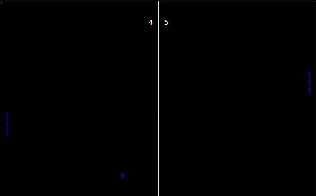

# PingPong70

Pong-curses is a 71 lines pong game written in C with NCURSES lib.
It's super simple and small but it works!

## COMPILATION

You maybe have to install ncurses library. So to install type:

    $ sudo apt-get install libncurses5-dev 

Go to its directory and tip:

    $ gcc pong.c -lncurses -o pong 

Then:

    $ ./pong 
